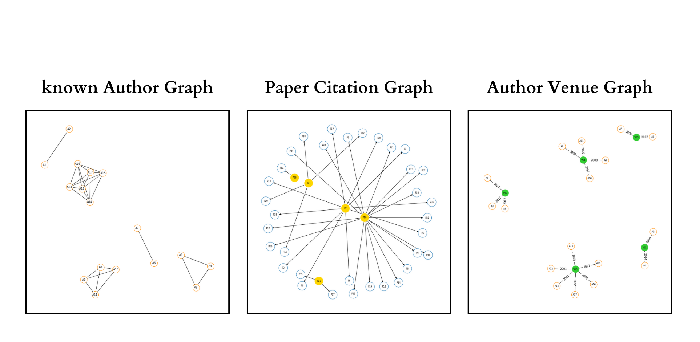

# Digital Bibliography and library project data analysis using Graph data structure

## • Utilizing Python's Networkx and pandas package, DBLP data was analyzed.
## • Undirected Author-Author Graph, Directed Paper-Citation Graph, Undirected Venue-Author Graph, and Network Characteristics were found for each of the three graphs. Results for sample data were manually verified for the study.
## • The top 5 authors with the most papers published were identified and analysed the paper publishing pattern.
## • Using the in-degree centrality approach, the top 5 referred papers were found.

## Note
**This repository serves as a demonstration of my work for the Foundations of Computing coursework. Kindly refrain from using the exact code provided here in any academic assignments. Its purpose is to provide a reference and facilitate learning for others.**
